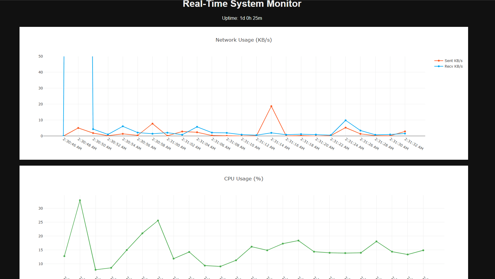

# System-Monitoring-Dashboard
Real-time system monitoring tool built with Python, Flask, SQLite, and Plotly. Collects CPU, memory, disk, network, and uptime metrics using a background psutil-based data collector and transfomrs the data to a visual dashboard in a web browser live-feed. Designed for learning, diagnostics, and lightweight system observability.

## 🎥 Live Dashboard Preview

